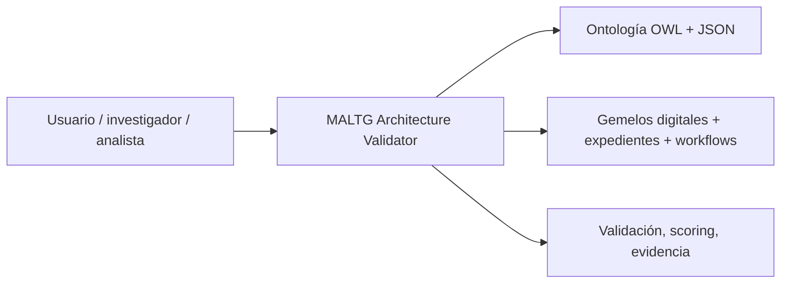
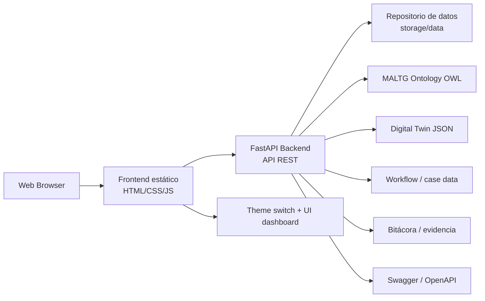
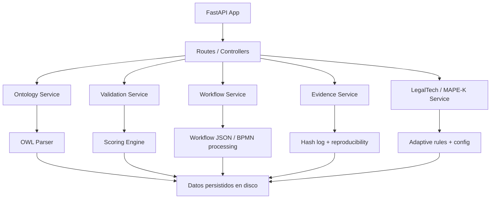
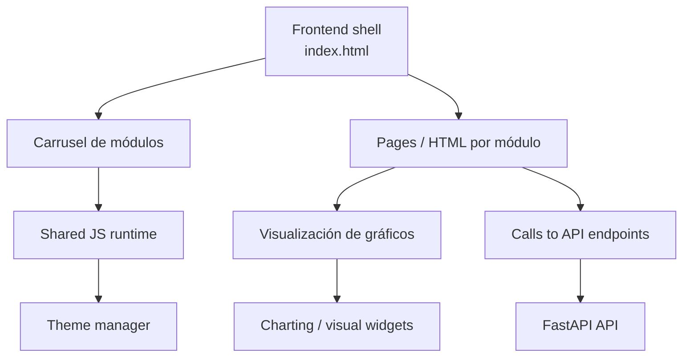
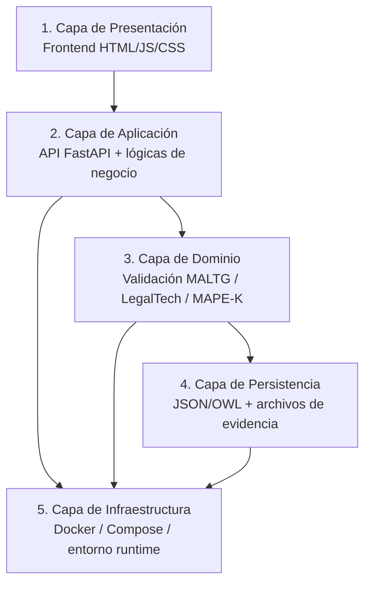

# Propuesta de arquitectura para MALTG Architecture Validator

## Antecedente del análisis

El análisis previo se basó en la estructura real del proyecto y en las evidencias de configuración de ejecución:

- [README.md](README.md): describe la aplicación como un dashboard web de validación de arquitectura LegalTech, con backend FastAPI, frontend HTML/CSS/JS y persistencia en archivos JSON/OWL.
- [docker-compose.yml](docker-compose.yml): define un único servicio `maltg` con `build.context: ./backend` y montaje de [frontend](frontend) y [storage/data](storage/data).
- [backend/main.py](backend/main.py): expone una API FastAPI que procesa ontologías, JSON de arquitectura, workflows y evidencia, sin depender de una base de datos relacional.

A partir de eso, la conclusión es que el sistema actual se comporta como un monolito modular con frontend estático y backend de dominio, orientado a análisis y **validación** documental/ontológica. No es una arquitectura distribuida por microservicios, sino una solución de prototipo académico+operativo con fuerte dependencia de archivos y **módulos** compartidos.

---

## 1) Propuesta de arquitectura C4

### Nivel 1: Sistema



### Nivel 2: Contenedores



### Nivel 3: Componentes del backend



### Nivel 4: Componentes del frontend



### Recomendación C4

La arquitectura C4 más fiel al proyecto actual es:

- Sistema: validador de arquitectura LegalTech
- Contenedores: frontend estático, backend FastAPI, almacenamiento de archivos, servicios de datos y evidencias
- Componentes: ontología, validación, workflows, evidencias, adaptatividad, presentación

Esto describe bien el estado actual sin forzar una estructura de microservicios que no existe.

---

## 2) Propuesta de arquitectura de capas formal

### Visión general

La arquitectura de capas se puede modelar como una solución con 5 capas, manteniendo el enfoque actual de baja complejidad y alta trazabilidad.



### Definición de capas

#### 1. Capa de presentación
Responsabilidad:
- Exponer el dashboard y módulos de navegación
- Permitir la exploración visual de ontologías, workflows y métricas
- Encapsular tema, layout y navegación compartida

Tecnologías:
- HTML5
- CSS
- JavaScript vanilla
- visualizaciones D3 / vis-network / Three.js (según módulo)

#### 2. Capa de aplicación
Responsabilidad:
- Exponer endpoints REST
- Agregar lógica de orquestación
- Integrar lectura de archivos y transformación de datos

Tecnologías:
- FastAPI
- Uvicorn
- Swagger/OpenAPI

#### 3. Capa de dominio
Responsabilidad:
- Evaluar conformidad ontológica y estructural
- Ejecutar validación de dimensiones
- Gestionar reglas adaptativas, evidencias y compliance LegalTech

Subdominios:
- `MALTG` validation
- `LegalTech compliance`
- `MAPE-K adaptive control`
- `workflow analysis`
- `evidence tracking`

#### 4. Capa de persistencia
Responsabilidad:
- Guardar ontología, reglas, archivos, bitácora, evidencia y resultados
- Mantener trazabilidad y reproducibilidad

Formato:
- OWL / RDF
- JSON-LD
- JSON
- CSV
- documentos de evidencia (PDF, XLSX, snapshots, manifests)

#### 5. Capa de infraestructura
Responsabilidad:
- Ejecutar contenedores
- Exponer puertos y entorno
- Mantener reuso de datos del proyecto entre host y contenedor

Tecnologías:
- Docker
- Docker Compose

---

## 3) Propuesta de evolución arquitectónica recomendada

El proyecto actual está bien para investigación y demostración, pero la mejor evolución a mediano plazo es esta:

### Opción A: mantener monolito modular (recomendación para esta etapa)

Ventajas:
- Simplicidad operativa
- Menor overhead
- Excelente para tesis, demo y validación
- Menor curva de aprendizaje

Estructura recomendada:

```text
appLegaltechTesis/
├── backend/
│   ├── app/
│   │   ├── api/
│   │   ├── domain/
│   │   ├── services/
│   │   ├── repositories/
│   │   └── core/
│   ├── main.py
│   └── requirements.txt
├── frontend/
│   ├── assets/
│   ├── pages/
│   └── index.html
├── storage/
│   └── data/
├── docker-compose.yml
└── README.md
```

### Opción B: separación funcional en servicios

Si el proyecto cruza a una etapa de producción, podría evolucionar a:

- `api-core` para validación y ontología
- `api-analytics` para workflow, evidencia y MAPE-K
- `web-frontend` para UI
- `storage` para archivos y datos persistentes

Esto sería más apropiado si se crean nuevos usuarios, autenticación, orquestación compleja y APIs internas más formales.

---

## 4) Conclusión

La arquitectura real del proyecto es compatible con un diseño de monolito modular, no con un sistema distribuido. La propuesta más honesta y útil es: mantener la separación conceptual entre frontend, backend, dominio y persistencia, pero reforzar la modularidad interna del backend para evitar que [backend/main.py](backend/main.py) se convierta en un archivo demasiado denso y difícil de sostener.

La recomendación práctica es:

- No forzar microservicios todavía
- Mejorar la organización interna del backend en módulos funcionales
- Mantener archivos como fuente de verdad para el dominio académico y analítico
- Preparar la base para una posible evolución a servicios cuando el sistema pase a producción

---

## 5) Resumen ejecutivo

- El proyecto actual es un monolito modular con frontend estático y backend de dominio.
- La mejor descripción arquitectónica es C4 + capas funcionales.
- La persistencia basada en archivos es una decisión correcta para la etapa actual.
- La evolución recomendada es reforzar modularidad interna, no convertirlo instantáneamente en microservicios.

Si se quiere, esta propuesta puede ampliarse a un diagrama en formato PlantUML o un archivo HTML listo para abrir en el navegador.
